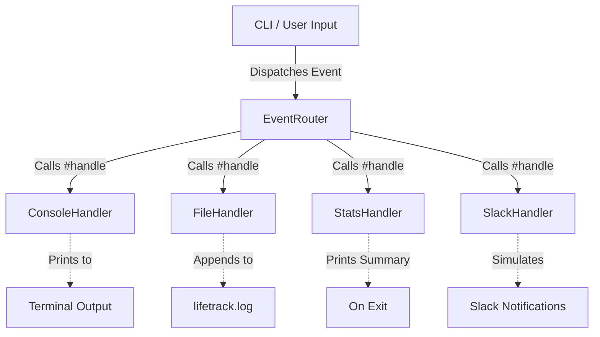

# 💎 Ruby Lab: AI + Human Handshake

Welcome to the **Ruby Software Engineering Lab** repository. This project covers a full spectrum of Ruby development, from writing logic solo and auditing AI-generated code to designing robust object-oriented software using SOLID principles and classical design patterns.

The lab is split into three main phases:
1. **Phase 1**: Grade Calculator (Solo development)
2. **Phase 2**: Bank Account Audit (Debugging AI-generated code)
3. **Phase 3**: LifeTrack Smart Event Router (Architecting pluggable event pipeline)

---

## 📂 Repository Layout

```
 AhmedMohO/lab1-phase3 (Workspace Root)
 ├── README.md                # This overall project documentation
 └── tree/
     └── lab1/
         └── phase3/          # Phase 3: LifeTrack Application
             ├── handlers/
             │   ├── console_handler.rb
             │   ├── file_handler.rb
             │   ├── stats_handler.rb
             │   └── slack_handler.rb
             ├── event.rb
             ├── event_router.rb
             ├── handler.rb
             ├── main.rb
             ├── lifetrack.log
             └── LAB.md       # Requirements and Architect's Test answers
```

*Note: The following related assets are located in the parent directory context:*
- **Phase 1 (Grade Calculator)**: `../phase1/main.rb`
- **Phase 2 (Bank Account)**: `../../bank_account_buggy.rb`

---

## 🚀 Phase Overview & Instructions

### 📈 Phase 1 — Grade Calculator
A command-line script that prompts the user for scores, validates that input values are within range, computes average/maximum/minimum metrics, and determines grade letter values.
- **Location**: `../phase1/`
- **Execution Command**:
  ```bash
  ruby ../phase1/main.rb
  ```

---

### 🏦 Phase 2 — Bank Account Audit
An exercise in auditing AI-generated code containing intentional syntax errors and logical flaws (e.g. balance math bugs, incorrect string formatting, missing closures, missing validation checks). 
All bugs are documented with the `# BUG [n]` tag, and fully resolved.
- **Location**: `../../bank_account_buggy.rb`
- **Execution Command**:
  ```bash
  ruby ../../bank_account_buggy.rb
  ```

---

### 🔄 Phase 3 — LifeTrack Event Router
An interactive CLI tool that allows logging work sessions, study sessions, workouts, and meals. It routes each event to a pluggable pipeline of output handlers simultaneously.

#### Architecture diagram:


#### Pluggable Outputs:
- **ConsoleHandler**: Prints human-readable event log directly to the terminal.
- **FileHandler**: Appends the event string to `lifetrack.log`.
- **StatsHandler** (Third Output): Tracks event stats and uses an `at_exit` hook to show a total summary when exiting.
- **SlackHandler** (Bonus): Simulates real-time Slack webhook notifications.

- **Location**: `tree/lab1/phase3/`
- **Execution Command**:
  ```bash
  ruby tree/lab1/phase3/main.rb
  ```

---

## 🎨 Design Patterns & SOLID Principles

Phase 3 implements modern Ruby object-oriented practices:
* **Observer Pattern**: The `EventRouter` registers handlers and notifies them simultaneously upon dispatched events.
* **Strategy Pattern**: Concrete output handlers act as interchangeable algorithms.
* **SOLID Compliance**:
  - **S**: Each class is focused on one responsibility.
  - **O**: Adding new handlers requires no modifications to the router itself.
  - **L**: Handlers are interchangeable at runtime.
  - **I**: Subclasses only implement `handle(event)`.
  - **D**: `EventRouter` depends strictly on the `Handler` abstract interface, never on concrete handler names.
