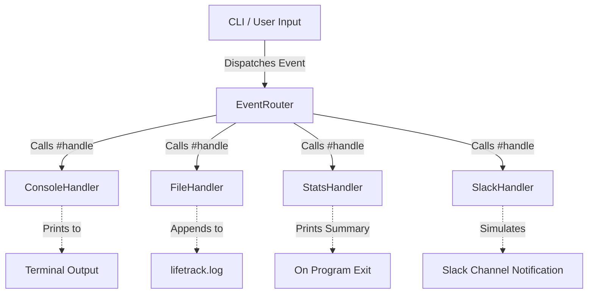

# 📊 LifeTrack — Smart Event Router

LifeTrack is a modular Command Line Interface (CLI) application built in Ruby that demonstrates the power of clean code, **SOLID design principles**, and classic software design patterns (**Observer** and **Strategy**).

This project was developed as part of **Phase 3** of the Ruby Lab.

---

## 🛠️ System Architecture

LifeTrack utilizes a decoupled event-routing mechanism. The system is designed to allow the dynamic addition of various handlers (outputs) without modify the core routing logic, demonstrating the **Open/Closed Principle (OCP)**.



### Key Design Patterns

1. **Observer Pattern**: `EventRouter` acts as the subject, keeping a list of registered observers (handlers) and notifying them simultaneously whenever a new event is logged.
2. **Strategy Pattern**: Each concrete `Handler` implements a swap-in/swap-out strategy for reacting to events. The router interacts exclusively with the abstract `Handler` interface.

---

## 🌟 SOLID Alignment

* **S (Single Responsibility)**: Each handler class has exactly one job (e.g., `FileHandler` handles file writing; `ConsoleHandler` prints to stdout). The `EventRouter` does not manage menus or format text.
* **O (Open / Closed)**: Adding a new handler (such as the `SlackHandler` bonus) is done by creating a new file under `handlers/`. The existing router code remains completely unchanged.
* **L (Liskov Substitution)**: All handlers inherit from `Handler` and are fully interchangeable. The router treats all handlers identically.
* **I (Interface Segregation)**: The shared handler contract defines exactly one method (`handle(event)`). No handler is forced to implement unused interfaces.
* **D (Dependency Inversion)**: The `EventRouter` depends strictly on the abstraction (`Handler` class contract), never referencing concrete class names (like `ConsoleHandler`) directly.

---

## 📂 Project Structure

```
phase3/
├── handlers/
│   ├── console_handler.rb  # Prints event messages to console
│   ├── file_handler.rb     # Appends event text to a log file
│   ├── stats_handler.rb    # Tracks statistics and outputs summary at exit
│   └── slack_handler.rb    # Simulates Slack notifications (Bonus)
├── event.rb                # Data class representing a logged session
├── event_router.rb         # Decoupled notification dispatch system
├── handler.rb              # Base contract raising NotImplementedError
├── main.rb                 # Application entry point & interactive loop
├── lifetrack.log           # Generated output log
└── LAB.md                  # Lab requirements and answers
```

---

## 🚀 Setup & Execution

### Prerequisites

Ensure you have **Ruby** installed on your system. 

### Running the CLI

To start the interactive prompt, execute `main.rb` from the `phase3` directory:

```bash
ruby main.rb
```

### Example Walkthrough

Upon starting, you will see the interactive menu:
```
=== LifeTrack ===
1. Log a work session
2. Log a study session
3. Log an exercise session
4. Log a meal
5. Exit

Choose an option: 2
Description: Deep work on Ruby SOLID principles
Duration (minutes): 45
```

Once you enter the details, all registered handlers fire simultaneously:
```
[2026-06-11 16:39] STUDY — Deep work on Ruby SOLID principles (45 min)
✓ Event logged.
[Slack] 🔔 Notification: [2026-06-11 16:39] STUDY — Deep work on Ruby SOLID principles (45 min)
```

Selecting option `5` (Exit) triggers the `StatsHandler` exit hook to output a summary session report:
```
Goodbye!

=== LifeTrack Summary ===
Total events: 1
Total duration: 45 minutes
Average session: 45.0 minutes
==========================
```
